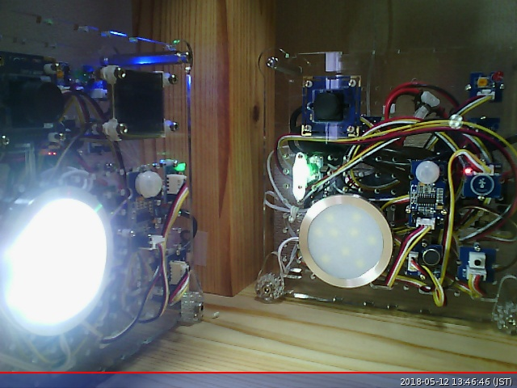

# Intel - Online Plugfest
March 2021.

## Geolocation
The following TDs are test cases for the [proposed geolocation information model](https://github.com/w3c/wot-discovery/blob/main/proposals/geolocation.md).
They cover the following use cases:
* [Static location embedded in the TD itself](intel-ocf/Intel-OCF-button2touch.jsonld)
* [Dynamic location provided by Thing property referenced by a TD](intel-geolocator.jsonld)
* [Location provided by another Thing](intel-camera.jsonld)
Note the use of a link with relation type "geolocationOf" so that a consumer knows where
to find the geolocation information in all three cases.
In some cases these examples are not completely up to date with respect to the proposal.
When creating new TDs, please follow the spec, not the examples.  I plan to update the 
examples to match the spec, not vice-versa.

There is also the following:
* [Old proposal](intel-ocf/Intel-OCF-button1touch.jsonld) - simple, but does not scale well for
  additional information, and only works for static information.  Should probably be moved
  to an "obsolete" section, but provided for comparison.

To Do:
* There are several other variants in the above proposal for things like velocity, acceleration,
  and FOI that should be added.
* There is no actual ontology file for the context URL and information model, and this would be
  useful to support RDF databases and SPARQL queries, etc.

## Cameras and Speech Services
NOTE: below is out of date, in particular devices are not (yet?) active for the March 2021 Plugfest.
Will update when I get a chance.

Two services are provided:
* A Simple Web Camera
* A Simple Speech Synthesizer

### Authentication
These services support end-to-end security via a cloud proxy.
Use the credentials, linked below, 
for "wotbasicproxy" or "wodigestproxy" based on whether you are using
basic or digest authentication.
Both services use the same credentials.

* [Proxy Authentication Credentials](https://lists.w3.org/Archives/Member/member-wot-ig/2018May/0003.html)

W3C WoT membership is required to access these credentials.
Please do not repost them in a public forum
(for example,
do not check the keys into a public github repo as part of a test suite,
post on a forum,
share in a public messaging system, etc).
These will be updated periodically so if an access does not work,
check that you have the latest version.

### Simple Web Camera
An example image is given below.
Note that "observe" generally needs client-side support.
For example, 
long polling requires a new request to be set up after every response.
However, to demonstrate "observe" with continuous update a browser 
extension like "Auto Refresh Plus" can be used to 
automatically resubmit a GET request after each response.
Since long polling is used the GET will "wait" until the server responds,
and as long as the interval set to generate a new request is less than
that of the server then the rate will be set by the server.



Summary of network API (see TDs for details):
* `/api` - get Thing Description
    * `/frame` - get last frame captured
        - `/observe` get next frame captured when ready (long polling)
    * `/exposure` - get/set manual exposure
        - `/observe` - observe changes in (manual) exposure (long polling)
    * `/crop` - get cropped version of last frame captured
        - an action using POST
        - JSON parameters are given in body of request
    * `/region` - get cropped version of last frame captured
        - an action using POST
        - query parameters are embedded in request URL
    
**WARNING: ideally writing to properties like "brightness"
should update the corresponding V4L parameters in the camera.
In practice it tends to crash the camera driver, so...
These properties are only supported in read-only mode currently
and the TD reflects this.
Sorry.**

#### HTTP and Nosec 
* Local Access (must be on same LAN, uses mDNS):
    - [TD](http://plus2.local:9190/api) 
    - [frame](http://plus2.local:9190/api/frame)
    - [frame/observe](http://plus2.local:9190/api/frame/observe)
          
#### HTTPS and Basic Auth
These require the credentials corresponding to `wotbasicproxy`.
* Digital Ocean Portal (California):
    - [TD](https://portal.mmccool.net:8098/api) 
    - [frame](https://portal.mmccool.net:8098/api/frame)
    - [frame/observe](https://portal.mmccool.net:8098/api/frame/observe)
* AWS Portal (Tokyo):
    - [TD](https://tiktok.mmccool.org:8098/api) 
    - [frame](https://tiktok.mmccool.org:8098/api/frame) 
    - [frame/observe](https://tiktok.mmccool.org:8098/api/frame/observe)

#### HTTPS and Digest Auth
* Digital Ocean Portal (California):
    - [TD](https://portal.mmccool.net:8099/api)
    - [frame](https://portal.mmccool.net:8099/api/frame)
    - [frame/observe](https://portal.mmccool.net:8099/api/frame/observe)
* AWS Portal (Tokyo):
    - [TD](https://tiktok.mmccool.org:8099/api) 
    - [frame](https://tiktok.mmccool.org:8099/api/frame)
    - [frame/observe](https://tiktok.mmccool.org:8099/api/frame/observe)
       
### Web Speak
This is a simple speech synthesizer service based on `espeak`.

Summary of network API: 
* POST a quoted English string to /api/say and it will speak it.
* For example, to say "this is a test" using Basic Auth via the AWS Portal, use the following
    - (replace "password" with the actual password...)

```
curl -X POST -H "Content-Type: application/json" -d '"this is a test"' -u "wotbasicproxy:password" https://tiktok.mmccool.org:8096/api/say

```
#### HTTP and Nosec 
* Local Access (must be on same LAN, uses mDNS):
    - [TD](http://plus2.local:8085/api) 
          
#### HTTPS and Basic Auth
* Digital Ocean Portal (California):
    - [TD](https://portal.mmccool.net:8096/api) 
* AWS Portal (Tokyo):
    - [TD](https://tiktok.mmccool.org:8096/api) 

#### HTTPS and Digest Auth
* Digital Ocean Portal (California):
    - [TD](https://portal.mmccool.net:8097/api) 
* AWS Portal (Tokyo):
    - [TD](https://tiktok.mmccool.org:8097/api) 
